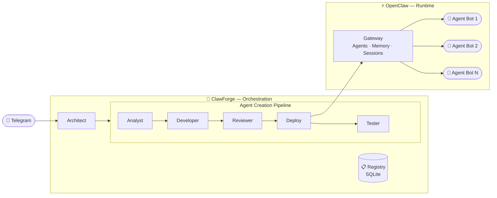

**English** · [Русский](README_RU.md)


# ClawForge

**Self-expanding AI agent factory built on [OpenClaw](https://openclaw.ai).**

Describe a task in Telegram — ClawForge designs, builds, tests, and deploys a specialized AI agent. Each solved task expands the system: new agents, skills, and automations become available for future requests.

## Architecture

ClawForge is the orchestration brain. OpenClaw is the runtime.



## What It Does

- **Agent creation pipeline** — 4-stage pipeline (analyst → developer → reviewer → tester) with runtime testing of deployed agents
- **Self-expansion** — the registry grows with every solved task; new requests can reuse, extend, or build upon existing agents
- **Per-bot architecture** — each agent gets its own Telegram bot, no shared routing, no switching conflicts
- **Scheduled automations** — cron-based heartbeats for recurring tasks (daily digests, price monitoring, etc.)
- **Executable scripts** — developer generates scripts (Python/Node.js) for precise computations, browser automation, API integrations
- **Task delegation** — architect can delegate tasks to any created agent via sub-agents

## How It Works

### Pipeline Stages

| Stage | Role |
|---|---|
| **Analyst** | Analyzes the task, checks the registry, produces requirements and test cases |
| **Developer** | Generates agent configuration (SOUL.md, skills, scripts) |
| **Reviewer** | Static review: validates artifacts, checks for duplicates and platform issues |
| **Tester** | Deploys the agent and runs a real test — sends a message, evaluates the response |

### Strategies

| Strategy | When | Example |
|---|---|---|
| `create_new` | No suitable agent exists | "I need a resume scoring agent" |
| `extend_existing` | An existing agent needs new capabilities | "Add report export to my tracker" |
| `reuse_existing` | A matching agent already exists | "Do you have a price monitor?" |
| `automation_only` | Only a cron schedule is needed | "Send me a daily digest at 10 AM" |

### Example

```
ClawForge: Hi! I'm ClawForge, an AI agent architect.

           I design, build, and manage a team of specialized
           AI agents for your tasks.

           /list — show created agents
           /rm <name> — delete an agent
           /new — new session

           What would you like to build?

User:      I need an agent that scores resumes.
ClawForge: [pipeline: analyst → developer → reviewer → tester]
           Agent resume-scorer created!
           Link it to a Telegram bot — send me a token from @BotFather.

User:      7712345678:AAF...
ClawForge: Done! Bot @ResumeScorer_bot is linked to resume-scorer.
           Send it a message to get started.

--- in @ResumeScorer_bot ---

User:           [PDF]
Resume Scorer:  Candidate: 8/10. Strong stack, sufficient experience.

--- back in ClawForge ---

User:      /list
ClawForge: 1. resume-scorer — resume evaluation (@ResumeScorer_bot)
           2. price-watcher — flight price monitoring (@PriceWatch_bot)

User:      /rm price-watcher
ClawForge: Delete agent price-watcher? Confirm: yes/no
User:      yes
ClawForge: Agent price-watcher deleted.
```

## Tech Stack

| Component | Technology |
|---|---|
| AI agents, memory, sessions | OpenClaw Gateway |
| LLM | Any supported by OpenClaw (Claude, GPT, Gemini, etc.) |
| Delivery channel | Telegram (via OpenClaw) |
| Orchestration | Python |
| Agent registry | SQLite |

## Getting Started

Requirements: Ubuntu server, Python 3.10+.

```bash
# 1. Install OpenClaw (installs Node.js automatically)
curl -fsSL https://openclaw.ai/install.sh | bash

# During OpenClaw onboarding:
#   - Onboarding mode → QuickStart
#   - Select channel → Telegram (Bot API)
#   - Provide a Telegram bot token (get one from @BotFather)
#   - Configure skills → No (ClawForge will install skills)
#   - Hooks → Skip for now
#   - Hatch your bot → Do this later (ClawForge will configure the agent)

# After onboarding — send /start to the bot in Telegram,
# get the pairing code and approve it on the server:
openclaw pairing approve telegram <PAIRING_CODE>

# 2. Install ClawForge
cd /opt
git clone https://github.com/maesthrow/claw-forge.git clawforge
cd clawforge
python setup.py
# Telegram ID is detected automatically from pairing data.
# If pairing hasn't been done yet — setup will warn you;
# after pairing, run: python setup.py --update
```

```bash
# Update (after pulling new changes)
cd /opt/clawforge
git pull                       # fetch latest files
python setup.py --update       # apply changes to OpenClaw

# Uninstall
python setup.py --uninstall    # remove ClawForge, restore clean OpenClaw
```

## Commands

| Command | Description |
|---|---|
| `/list` | List created agents |
| `/rm <name>` | Delete an agent (with confirmation) |
| `/new` | Start a new session |
| Natural language | "cancel creation", "what agents do I have?", "subscribe me" |

## Documentation

See [ARCHITECTURE.md](docs/ARCHITECTURE.md) for detailed technical documentation: module internals, design decisions, deployment details, and workspace file structure.
