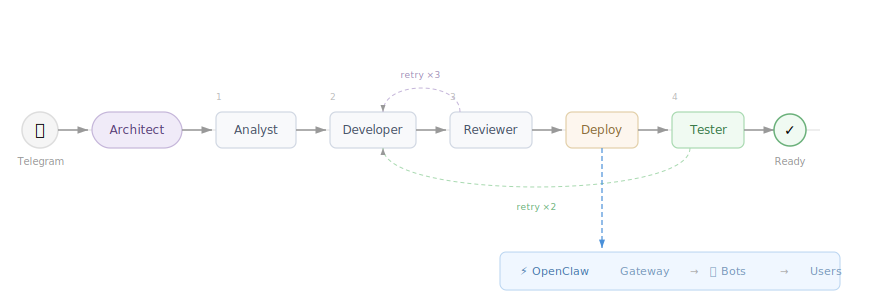

[English](README.md) · **Русский**


# ClawForge

**Саморасширяющаяся фабрика AI-агентов на базе [OpenClaw](https://openclaw.ai).**

Опишите задачу в Telegram — ClawForge спроектирует, соберёт, протестирует и задеплоит специализированного AI-агента. Каждая решённая задача расширяет систему: новые агенты, навыки и автоматизации становятся доступны для будущих запросов.

## Архитектура

ClawForge — мозг оркестрации. OpenClaw — среда выполнения.



## Что делает

- **Конвейер создания агентов** — 4-этапный конвейер (аналитик → разработчик → ревьюер → тестировщик) с реальным тестированием задеплоенных агентов
- **Саморасширение** — реестр растёт с каждой решённой задачей; новые запросы могут переиспользовать, расширять или строить поверх существующих агентов
- **Архитектура «один агент — один бот»** — каждый агент получает собственного Telegram-бота, без общей маршрутизации и конфликтов переключения
- **Автоматизации по расписанию** — cron-based heartbeat для регулярных задач (ежедневные дайджесты, мониторинг цен и т.д.)
- **Исполняемые скрипты** — разработчик генерирует скрипты (Python/Node.js) для точных вычислений, автоматизации браузера, интеграции с API
- **Делегирование задач** — архитектор может делегировать задачи любому созданному агенту через суб-агентов

## Как это работает

### Этапы конвейера

| Этап | Роль |
|---|---|
| **Analyst** | Анализирует задачу, проверяет реестр, формирует требования и тест-кейсы |
| **Developer** | Генерирует конфигурацию агента (SOUL.md, навыки, скрипты) |
| **Reviewer** | Статическая проверка: валидация артефактов, дубли, платформо-специфика |
| **Tester** | Деплоит агента и проводит реальный тест — отправляет сообщение, оценивает ответ |

### Стратегии

| Стратегия | Когда | Пример |
|---|---|---|
| `create_new` | Подходящего агента не существует | «Мне нужен агент для оценки резюме» |
| `extend_existing` | Существующему агенту нужны новые возможности | «Добавь экспорт отчётов в мой трекер» |
| `reuse_existing` | Подходящий агент уже существует | «Есть ли у тебя мониторинг цен?» |
| `automation_only` | Нужно только cron-расписание | «Присылай мне ежедневный дайджест в 10 утра» |

### Пример

```
ClawForge: Привет! Я ClawForge — архитектор AI-агентов.

           Я проектирую, создаю и управляю командой
           специализированных AI-агентов для ваших задач.

           /list — показать созданных агентов
           /rm <имя> — удалить агента
           /new — новая сессия

           Что хотите создать?

User:      Мне нужен агент, который оценивает резюме.
ClawForge: [конвейер: аналитик → разработчик → тестировщик → валидатор]
           Агент resume-scorer создан!
           Привяжите его к Telegram-боту — пришлите мне токен от @BotFather.

User:      7712345678:AAF...
ClawForge: Готово! Бот @ResumeScorer_bot привязан к resume-scorer.
           Отправьте ему /start, чтобы начать.

--- в @ResumeScorer_bot ---

User:           [PDF]
Resume Scorer:  Кандидат: 8/10. Сильный стек, достаточный опыт.

--- обратно в ClawForge ---

User:      /list
ClawForge: 1. resume-scorer — оценка резюме (@ResumeScorer_bot)
           2. price-watcher — мониторинг цен на авиабилеты (@PriceWatch_bot)

User:      /rm price-watcher
ClawForge: Удалить агента price-watcher? Подтвердите: да/нет
User:      да
ClawForge: Агент price-watcher удалён.
```

## Технологический стек

| Компонент | Технология |
|---|---|
| AI-агенты, память, сессии | OpenClaw Gateway |
| LLM | Любая, поддерживаемая OpenClaw (Claude, GPT, Gemini и др.) |
| Канал доставки | Telegram (через OpenClaw) |
| Оркестрация | Python |
| Реестр агентов | SQLite |

## Начало работы

Требования: Ubuntu-сервер, Python 3.10+.

```bash
# 1. Install OpenClaw (installs Node.js automatically)
curl -fsSL https://openclaw.ai/install.sh | bash

# During OpenClaw onboarding:
#   - Onboarding mode → QuickStart
#   - Select channel → Telegram (Bot API)
#   - Provide a Telegram bot token (get one from @BotFather)
#   - Configure skills → No (ClawForge will install skills)
#   - Hooks → Skip for now
#   - Hatch your bot → Do this later (ClawForge will configure the agent)

# After onboarding — send /start to the bot in Telegram,
# get the pairing code and approve it on the server:
openclaw pairing approve telegram <PAIRING_CODE>

# 2. Install ClawForge
cd /opt
git clone https://github.com/maesthrow/claw-forge.git clawforge
cd clawforge
python setup.py
# Telegram ID is detected automatically from pairing data.
# If pairing hasn't been done yet — setup will warn you;
# after pairing, run: python setup.py --update
```

```bash
# Update (after pulling new changes)
cd /opt/clawforge
git pull                       # fetch latest files
python setup.py --update       # apply changes to OpenClaw

# Uninstall
python setup.py --uninstall    # remove ClawForge, restore clean OpenClaw
```

## Команды

| Команда | Описание |
|---|---|
| `/list` | Показать созданных агентов |
| `/rm <имя>` | Удалить агента (с подтверждением) |
| `/new` | Начать новую сессию |
| Естественный язык | «отмени создание», «какие у меня агенты?», «подпиши меня» |

## Документация

Подробная техническая документация — устройство модулей, проектные решения, детали деплоя и структура файлов рабочего пространства — доступна в [ARCHITECTURE.md](docs/ARCHITECTURE.md) (English) и [ARCHITECTURE_RU.md](docs/ARCHITECTURE_RU.md) (Русский).
